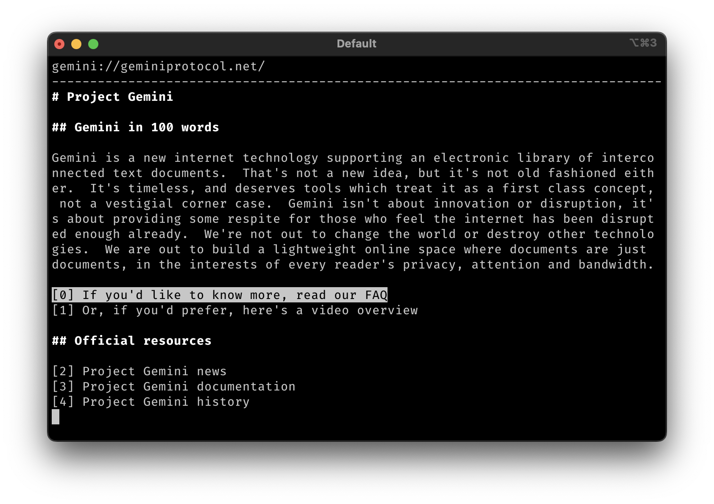

# gemnet

A telnet-to-Gemini proxy server that enables vintage computing systems to browse the modern Gemini protocol.



## What is gemnet?

gemnet bridges the gap between old technology and the Gemini ecosystem by providing a plain-text, ASCII-only interface over telnet. It's perfect for:

- Vintage computers that lack TLS support
- Systems limited to 8-bit ASCII (no UTF-8)
- Low-bandwidth connections (optimized for slow baud rates)
- Anyone who wants to browse Gemini from a simple telnet client

## Features

- **Full Gemini protocol support** - Browse any gemini:// site
- **TLS handling** - Server handles all TLS connections transparently
- **UTF-8 to ASCII conversion** - Intelligent character mapping with fallbacks
- **Link navigation** - Numbered links with keyboard navigation
- **Browser-like history** - Back/forward navigation with state preservation
- **Smart rendering** - Partial screen updates for responsive navigation on slow connections
- **Header highlighting** - Bold text for Gemini headers
- **Line wrapping** - Content wraps to fit your terminal width

## Building

Requirements: Go 1.21 or later

```bash
go build
```

## Running

### Running Directly

Start the server:

```bash
./gemnet
```

The server listens on port 2323 by default.

### Running as a systemd Service (Linux)

1. Create a dedicated user for gemnet:
```bash
sudo useradd -r -s /bin/false gemnet
```

2. Install gemnet:
```bash
sudo mkdir -p /opt/gemnet
sudo cp gemnet /opt/gemnet/
sudo chown -R gemnet:gemnet /opt/gemnet
```

3. Install the systemd service file:
```bash
sudo cp etc/systemd/system/gemnet.service /etc/systemd/system/
sudo systemctl daemon-reload
```

4. Enable and start the service:
```bash
sudo systemctl enable gemnet
sudo systemctl start gemnet
```

5. Check status:
```bash
sudo systemctl status gemnet
```

6. View logs:
```bash
sudo journalctl -u gemnet -f
```

The systemd service includes security hardening and automatic restart on failure.

## Connecting

From any telnet client:

```bash
telnet localhost 2323
```

Or connect from a vintage computer using any telnet program!

## Usage

### Navigation

- **Up/Down arrows** - Navigate between links on the current page
- **Enter** - Follow the selected link
- **Left arrow** or **Backspace** - Go back in history
- **Right arrow** - Go forward in history
- **Page Up/Page Down** - Scroll the page
- **g** - Enter a new Gemini URL
- **q** - Quit

### On Connection

gemnet automatically loads `gemini://geminiprotocol.net/` as your starting page.

### Following Links

Links are displayed as `[0] Link Text`, `[1] Another Link`, etc. Use the arrow keys to highlight a link, then press Enter to follow it.

### Entering URLs

Press `g` to bring up the URL prompt. Type a Gemini URL (or just a hostname - `gemini://` will be added automatically) and press Enter.

## Technical Details

- **Protocol**: Full Gemini protocol implementation with TLS
- **Default port**: 2323 (configurable in main.go)
- **Terminal**: VT100/ANSI compatible
- **Terminal size**: Defaults to 80x24 (configurable in session.go)
- **Character encoding**: All UTF-8 content is converted to ASCII
- **Line endings**: Handles both CRLF and LF

### Architecture

- **main.go** - Telnet server
- **session.go** - Session management, UI rendering, and input handling
- **gemini.go** - Gemini protocol client
- **utils.go** - UTF-8 to ASCII conversion
- **etc/systemd/system/gemnet.service** - Example systemd service file

### Performance Optimizations

gemnet is optimized for vintage terminals with slow baud rates:

- **Partial rendering** - When navigating between links without scrolling, only the changed links are redrawn
- **Smart scrolling** - Direction-aware link selection when paging
- **State preservation** - History remembers scroll position and selected link for each page

## Development

See `CLAUDE.md` for detailed architecture documentation and development guidance.

## License

This is an educational/personal project. Use freely.

## Gemini Protocol

Learn more about the Gemini protocol at [gemini://geminiprotocol.net](gemini://geminiprotocol.net)

To view Gemini sites in a modern browser, you'll need a Gemini client like:
- Lagrange (GUI client)
- Amfora (terminal client)
- Or use gemnet from telnet!
